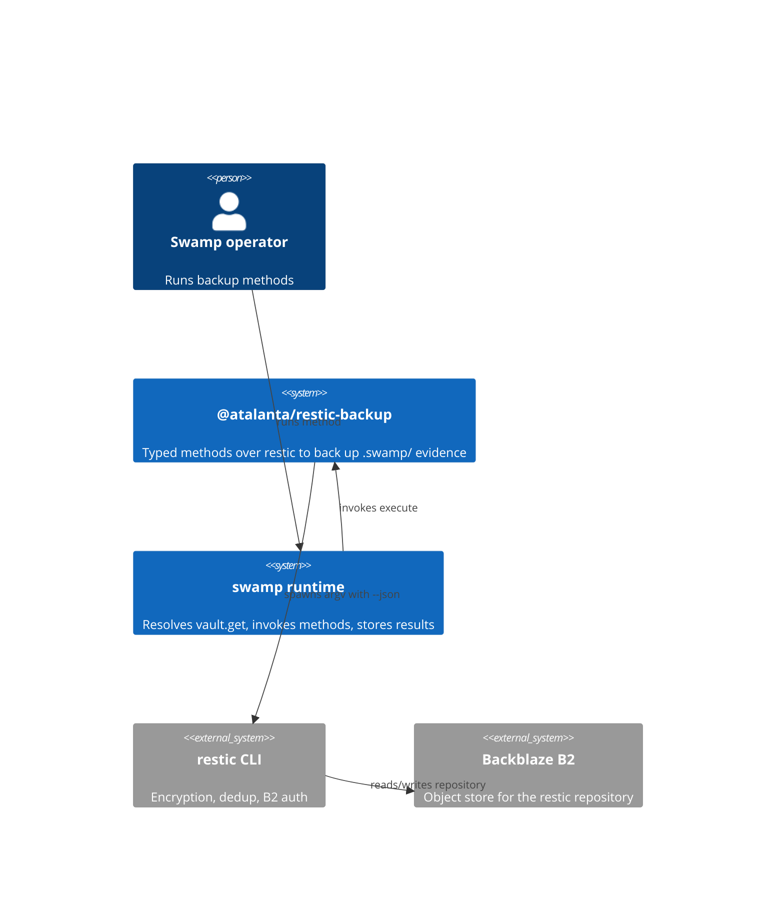
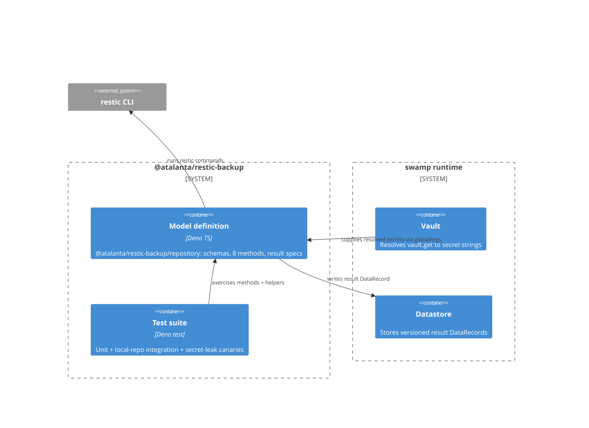
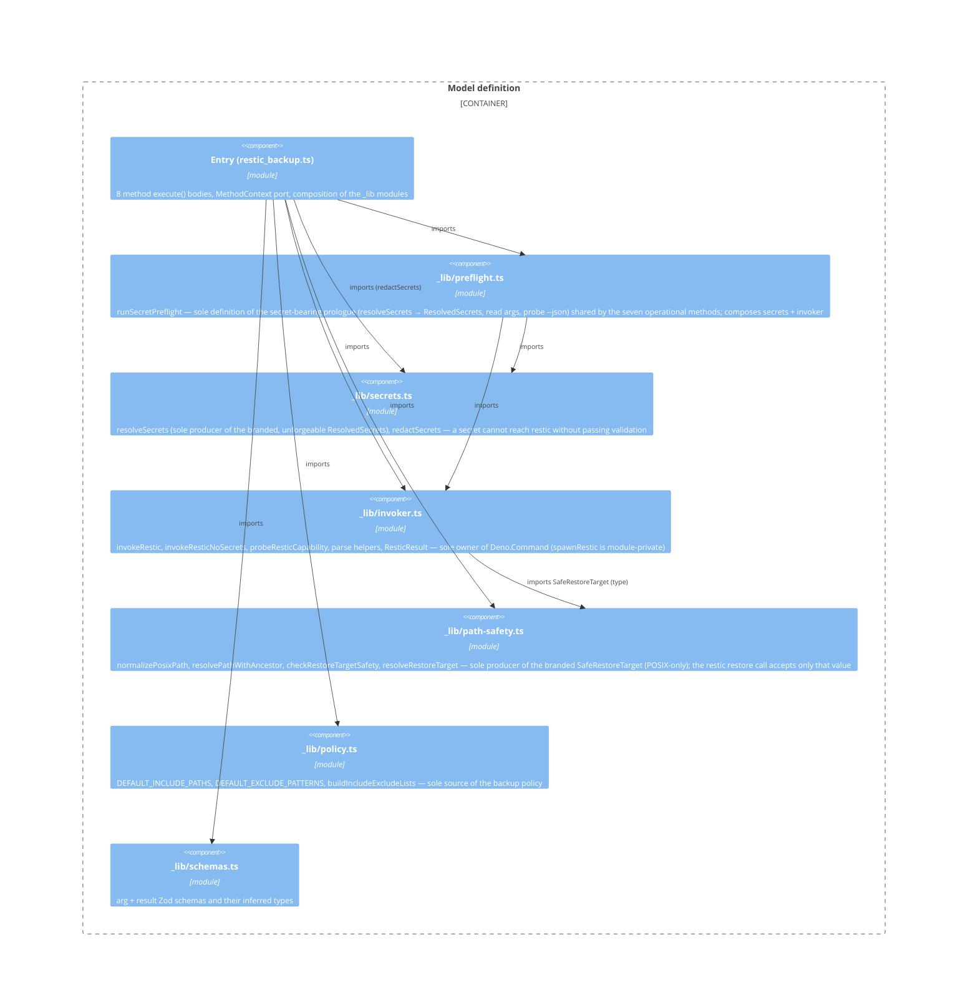

# Architecture (C4)

C4 model of the `@atalanta/restic-backup` swamp model extension. Findings from an
audit anchor to the elements named here.

## Context

The extension is a swamp model that turns operator method calls into `restic`
commands against a Backblaze B2 repository. swamp resolves the vault-sourced
secrets and stores results; restic owns encryption and B2 authentication.

## Containers

## Components (Model definition)

The "Model definition" container is the entry file
`extensions/models/restic_backup.ts` (the manifest's model entry) plus six
sibling modules under `extensions/models/_lib/`. The entry holds the eight
method bodies and the `MethodContext` port; each other concern is its own module
with boundaries enforced by the import graph.

The seven operational methods (`init`, `backup`, `snapshots`, `check`,
`restore`, `forget`, `prune`) obtain their secrets and repo inputs from
`runSecretPreflight`; `checkRestic` runs its `--json` probe without secrets and
does not use the pre-flight.

## Trust boundaries and invariants

- Secrets (restic password + two B2 credentials) enter only as `vault.get`
  references resolved by swamp; the Secret layer keeps resolved values out of
  argv, result resources, logs, and the backup.
- The restic invoker builds an argv array (no shell), always passing `--json`.
- Restore path safety refuses targets at the repo root, `.swamp/`, an ancestor
  of `.swamp/`, or inside `.swamp/`. The guard is structural: `resolveRestoreTarget`
  produces a branded `SafeRestoreTarget` only for a safe target or an explicit
  `confirm: true` override (recorded as `overridden` in the result), and the
  restic restore call accepts only that value — so an unchecked target cannot
  reach restic. Non-POSIX absolute targets are refused (POSIX-only).
- `_catalog.db` and bundle caches are excluded from the backup set.
