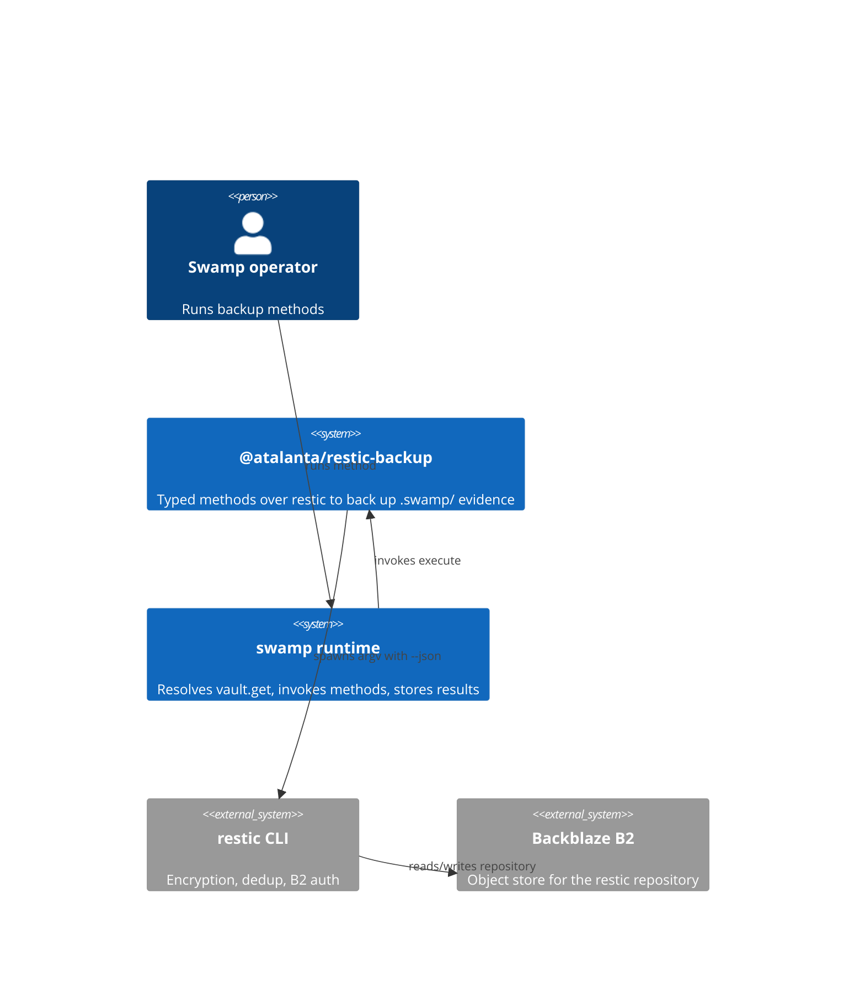
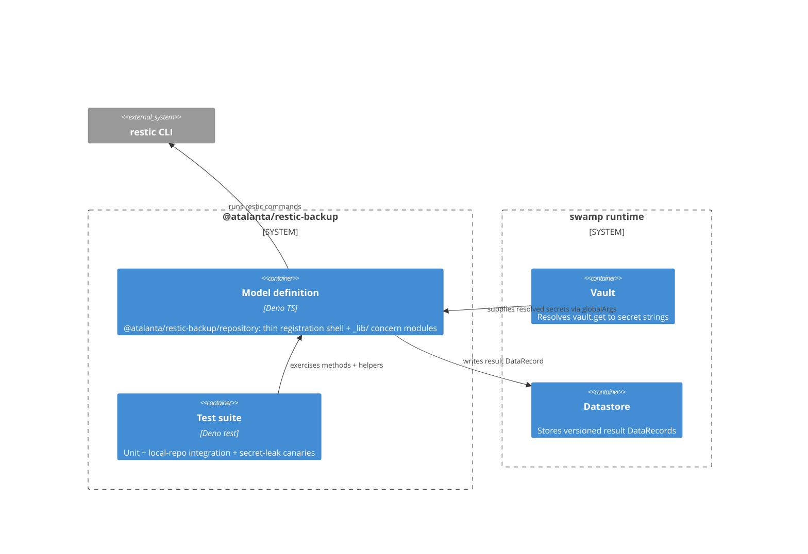
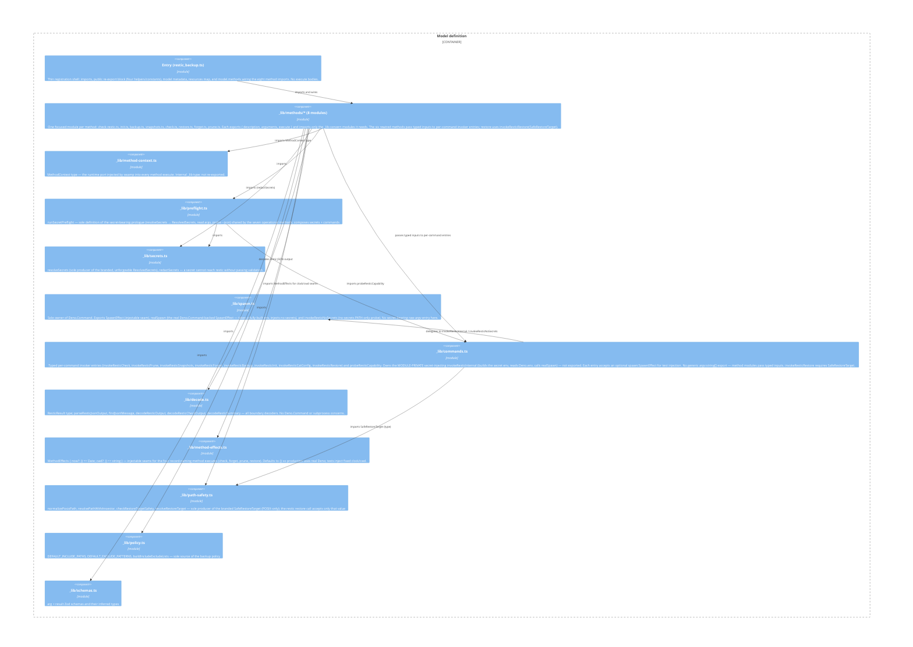

# Architecture (C4)

C4 model of the `@atalanta/restic-backup` swamp model extension. Findings from an
audit anchor to the elements named here.

## Context

The extension is a swamp model that turns operator method calls into `restic`
commands against a Backblaze B2 repository. swamp resolves the vault-sourced
secrets and stores results; restic owns encryption and B2 authentication.

## Containers

## Components (Model definition)

The "Model definition" container is a thin registration shell
`extensions/models/restic_backup.ts` (the manifest's model entry) plus modules
under `extensions/models/_lib/`. The entry imports the eight method definitions
from `_lib/methods/*` and wires them into `model.methods`; it contains no
`execute` bodies. Each method lives in its own focused module. All concern
modules are shared only through imports — boundaries are enforced by the
import graph.

The original single `_lib/invoker.ts` has been split into three modules with
distinct responsibilities, plus an effects seam:
- `_lib/spawn.ts` — sole owner of `Deno.Command` and `Deno.env`; exports the
  `SpawnEffect` injectable seam so tests can inject a fake spawn without
  launching a real process.
- `_lib/commands.ts` — typed per-command invoker entries; each accepts an
  optional `spawn: SpawnEffect` for test injection. No generic `argv: string[]`
  export.
- `_lib/decode.ts` — `ResticResult` type and all boundary decoders; no
  subprocess concerns.
- `_lib/method-effects.ts` — `MethodEffects { now?: () => Date; cwd?: () => string }`
  injectable seam for the four record-naming method executes (check, forget,
  prune, restore); defaults to `{}` so production uses real `Deno`.

The seven operational methods (`init`, `backup`, `snapshots`, `check`,
`restore`, `forget`, `prune`) obtain their secrets and repo inputs from
`runSecretPreflight`; `checkRestic` runs its `--json` probe without secrets and
does not use the pre-flight. The six rewired methods (`init`, `backup`,
`snapshots`, `check`, `forget`, `prune`) pass typed inputs to per-command
entries in `commands.ts`; `restore` uses `invokeResticRestore(SafeRestoreTarget)`.
No method module builds a raw argv array or imports a generic secret-injecting
invoker — `commands.ts`'s type surface is the enforcement boundary.

The four record-naming methods (`check`, `forget`, `prune`, `restore`) accept
an optional `effects: MethodEffects` third parameter for clock and cwd
injection. The swamp runtime never supplies this parameter; it is only used by
tests to inject a fixed `now` or `cwd` for deterministic record name assertions.

## Trust boundaries and invariants

- Secrets (restic password + two B2 credentials) enter only as `vault.get`
  references resolved by swamp; the Secret layer keeps resolved values out of
  argv, result resources, logs, and the backup.
- `commands.ts` exposes typed per-command entries (no generic `argv: string[]` export). Method modules pass typed inputs; the command entry assembles argv internally, always including `--json`. `spawn.ts` is the sole owner of `Deno.Command` and `Deno.env`.
- Restore path safety refuses targets at the repo root, `.swamp/`, an ancestor
  of `.swamp/`, or inside `.swamp/`. The guard is structural: `resolveRestoreTarget`
  produces a branded `SafeRestoreTarget` only for a safe target or an explicit
  `confirm: true` override (recorded as `overridden` in the result), and the
  restic restore call accepts only that value — so an unchecked target cannot
  reach restic. Non-POSIX absolute targets are refused (POSIX-only).
- `_catalog.db` and bundle caches are excluded from the backup set.
